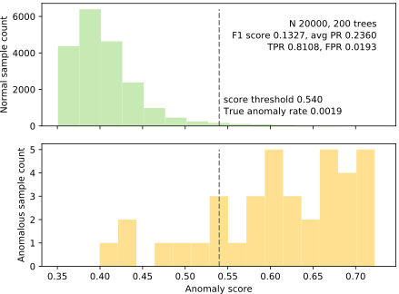

# Isolation Forest Implementation

Here I have implemented the Isolation forest with some personal customizations.

I have added preprocessing to remove noisy features by ranking columns by the average splitting benefit of choosing a particular column

I have sacrificed space for training speed. I cached the average depth of each point in a sample size x num trees matrix. This implementation may not be appropriate if you are using a large sample size. This is the beauty of this algorithm though, there is a degradation of return for adding data to your training set, to the point that even with 256 training data points, you can get good results.
## The Algorithm
All math equations, pictures, and model architecture is taken from this [algorithm's paper](https://cs.nju.edu.cn/zhouzh/zhouzh.files/publication/icdm08b.pdf?q=isolation-forest)


The Isolation tree makes a series of isolation trees. Each with a fixed maximum depth.


Each single isolation tree takes your data. Then it chooses a random feature and splits your data at a random split point(I limited this to the range between the max and min of the feature). This works because anomalies will tend not to reach the bottom of this tree if we pick a good maximum depth.


Inference is done by feeding a particular datapoint into each of the trees and observing the average depth across all trees. Then assigning it a score based off of this average depth(equation is below) and if this score is above a threshold you choose the data point is an anomaly. The range of these scores is roughly from \frac{1}{2} to $2$. Depending how you count depths starting at 0 or 1.


## The API
```
class IsolationTreeEnsemble:
    def __init__(self, sample_size, n_trees=10):
        
    def fit(self, X:np.ndarray, improved=False):
        Given a 2D matrix of observations, create IsolationTree objects and store them 

    def path_length(self, X:np.ndarray) -> np.ndarray:
        Given a 2D matrix of observations, X, compute the average path length
        for each observation in X.  Compute the path length for x_i using every
        tree in self.trees then compute the average for each x_i.  Return an
        ndarray of shape (len(X),1).

    def anomaly_score(self, X:np.ndarray) -> np.ndarray:
        """
        Given a 2D matrix of observations, X, compute the anomaly score
        for each x_i observation, returning an ndarray of them.
        """

    def predict_from_anomaly_scores(self, scores:np.ndarray, threshold:float) -> np.ndarray:
        """
        Given an array of scores and a score threshold, return an array of
        the predictions: 1 for any score >= the threshold and 0 otherwise.
        """

    def predict(self, X:np.ndarray, threshold:float) -> np.ndarray:
        "A shorthand for calling anomaly_score() and predict_from_anomaly_scores()."

class IsolationTree:
    def __init__(self, height_limit):

    def fit(self, X:np.ndarray, improved=False):
        """
        Given a 2D matrix of observations, create an isolation tree. Set field
        self.root to the root of that tree and return it.

        If you are working on an improved algorithm, check parameter "improved"
        and switch to your new functionality else fall back on your original code.
        """
        return self.root
```


## Scoring Results

These results were attained when 5 randomly generated columns were added to well known kaggle datasets to make our.

| Kaggle Dataset   |  Number of Trees |    True Positive Rate      |  False Positive Rate |
|----------|:-------------:|:-------------:|------:|
| creditcard |300|  80% | 0.0122% |
| http |300|    99%   |   0.0240% |
| cancer |1000 |75% |    0.0924% |

## Visible Results

Here is a representation of our algorithm's results. Though the data has been flattened to be graphical. These are not associated with the above tests.

### *Credit Card*

### *Cancer*

### *Http*


Notice how unintuitive the boundary is? This could be the result of flattening complicated data to 1 demension. The important thing is our model is good at predicting in the feature space that our data rests in.